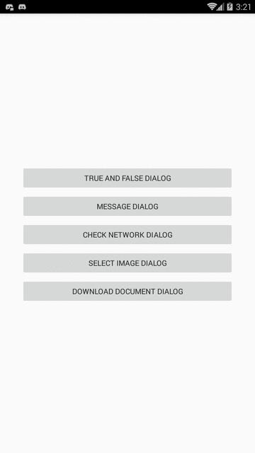

# PersianDialog
PersianDialog for Android,Very attractive with plenty of access

# ScreenShot

# Setup
The simplest way to use PersianDialog is to add the library as aar dependency to your build    

**Gradle**
1. Add the JitPack repository to your build file    
<pre>allprojects {
		repositories {
			...
			maven { url 'https://jitpack.io' }
		}
	}</pre>
2. Add the dependency  
<pre>dependencies {
  implementation 'com.github.mahmoodkarimizade:PersianDialog:1.0.0'
	}</pre>
  
# Usage
- define true and false dialog (question dialog)
<pre>
trueFalseDialog=new TrueFalseDialog(this);
trueFalseDialog.message.setText("Your Question ?");
trueFalseDialog.tFalse.setText("Cancel");
trueFalseDialog.tTrue.setText("OK");
trueFalseDialog.iFalse.setOnClickListener(new View.OnClickListener() {
    @Override
    public void onClick(View view) {

        //do some thing
        trueFalseDialog.dialog.dismiss();
    }
});
trueFalseDialog.iTrue.setOnClickListener(new View.OnClickListener() {
    @Override
    public void onClick(View view) {

        //do some thing
        trueFalseDialog.dialog.dismiss();
    }
});
</pre>

- define message dialog
<pre>
messageDialog=new MessageDialog(this);
messageDialog.message.setText("Your Message !");
messageDialog.tOK.setText("OK");
messageDialog.iOK.setOnClickListener(new View.OnClickListener() {
    @Override
    public void onClick(View view) {

        //do some thing
        messageDialog.dialog.dismiss();
    }
});
</pre>

- define check network dialog (wifi dialog)
<pre>
checkNetWorkDialog=new CheckNetWorkDialog(this);
checkNetWorkDialog.message.setText("Plz check your network and try again!");
checkNetWorkDialog.tWifi.setText("OK");
checkNetWorkDialog.iWifi.setOnClickListener(new View.OnClickListener() {
    @Override
    public void onClick(View view) {

        //do some thing
        checkNetWorkDialog.dialog.dismiss();
    }
});
</pre>

- define select image Dialog
<pre>
selectImageDialog=new SelectImageDialog(this);
selectImageDialog.message.setText("plz select your image!");
selectImageDialog.tCamera.setText("Camera");
selectImageDialog.tGallery.setText("Gallery");
selectImageDialog.iCamera.setOnClickListener(new View.OnClickListener() {
    @Override
    public void onClick(View view) {

        //do some thing
        selectImageDialog.dialog.dismiss();
    }
});
selectImageDialog.iCamera.setOnClickListener(new View.OnClickListener() {
    @Override
    public void onClick(View view) {

        //do some thing
        selectImageDialog.dialog.dismiss();
    }
});
</pre>
